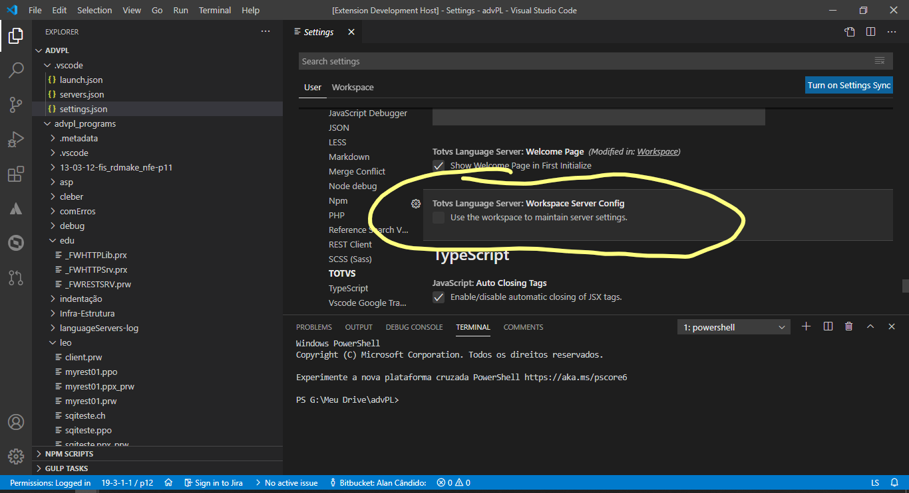
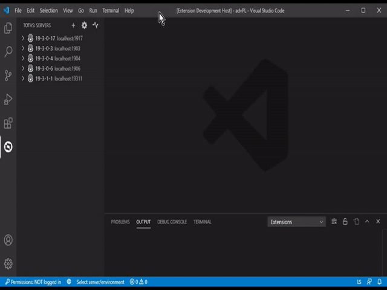

# Visão `Servers`

> Requisitos:
> - servidor a ser utilizado ou registrado em execução

## Registro de servidores

- Clique no icone `"+"` no canto superior direito da visão, ao lado da aba `Servidores`.
- Preencha as informações de `nome`, `ip` e `porta` do servidor.
- Clique no botão `Salvar`.
- Existe o atalho que para abertura do assistente: `CTRL + SHIFT + P` digite `TOTVS: Add Server`.


## Conexão com servidores

- Após executar o cadastro de ao menos um servidor.
- Vá para visão de servidores (Acesso pelo ícone da TOTVS na lateral esquerda do VSCode).
- Clique com o botão direito e selecione a opção `Connect`.
- Informe `ambiente`, `usuário` e `senha` (pode ser "em branco") para prosseguir.
- Aguarde o termino da conexão.
- A conexão com servidores pode ser efetuada pela seleção do texto `[Selecionar servidor/ambiente]` na barra de ferramentas. Ou pelo atalho `CTRL + SHIFT + P` digite `TOTVS: Select Server`.


## Configurações das definições

As configurações com os registros dos servidores podem ser editados manualmente, desde que com cuidado, via editor de texto.

Pode-se acessá-lo acionando o ícone semelhante a uma engrenagem.


## Local de gravação

Por padrão, o arquivo com os registros de servidores é armazenado no arquivo `servers.json`, na área do usuário conforme o sistema operacional.

* **Windows** `%USERPROFILE%\\.totvsls\\settings.json`
* **MacOS** `$HOME/.totvsls/settings.json`
* **Linux** `$HOME/.totvsls/settings.json`

Caso deseje ter o registro de servidores por área de trabalho, ative a opção em `File | Preferences | Settings | Extensions | TOTVS | Workspace server config`.



Ou use a troca rápida disponível na barra de _status_.



> A troca rápida aplica-se somente a área de trabalho corrente e se sobrepoem a configuração padrão ou por usuário. Detalhes em [User and Workspace Settings](https://code.visualstudio.com/docs/getstarted/settings).

## Sistema de Privilégios

O **TDS-VSCode**, suporta um sistema simples de privilégios, baseada em configuração efetuada no arquivo _appServer.ini_, podendo-se configurar  privilégios para determinadas operações e estações, através da adição de chaves na sessão `[TDS]`.

> Para manter o mesmo comportamento de ambientes com versões mais antigas, todas as operações vem liberadas por padrão, na ausência da sessão `[TDS]` ou da chave da operação.

### Especificação da sessão

```
[TDS]
ALLOWAPPLYPATCH=<ip list>
ALLOWEDIT=<ip list>
ENABLEDISCONNECTUSER=<ip list>
ENABLESENDMESSAGE=<ip list>
ENABLEBLOCKNEWCONNECTION=<ip list>
ENABLESTOPSERVER=<ip list>
ALLOWBUILDPATCH=<ip list>
ALLOWMONITOR=<ip list>
ALLOWCOMPILE=<ip list>
```

Chave | Permissão |
----- | --------- |
ALLOWAPPLYPATCH | Aplicar pacotes de atualização (_patchs_)
ALLOWEDIT | Editar configurações do _appServer_
ENABLEDISCONNECTUSER | Desconectar usuários
ENABLESENDMESSAGE | Enviar mensagens
ENABLEBLOCKNEWCONNECTION | Bloquear novas conexões
ENABLESTOPSERVER | Encerrar o _appServer_
ALLOWBUILDPATCH | Gerar pacotes de atualização (_patchs_)
ALLOWMONITOR | Monitorar conexões/sessões do _appServer_
ALLOWCOMPILE | Compilar fontes e recursos
|

- `Chave` deve ser sempre em maiúsculas
- `<ip list>` é a lista de estações com o privilégio liberado, identificadas pelo seu endereço IP e separadas por `,`.

> Para liberar o privilégio a qualquer estação, omita a chave ou coloque `*`.
